  
  
  

 

### 🧠 About Me

- 🎓 B.Tech CSE @ **BBD University** — Batch 2023–2027
- 🚀 Shipped **Customer Churn Prediction** — a full EDA-to-model pipeline
 

### 🧰 Tech Stack

  

  
  
  
  
  
  
  

 

### 🚀 Featured Project

 

### 📊 GitHub Stats

  
  

  

 

<i>Thanks for stopping by — let's build something great! ✨</i>

